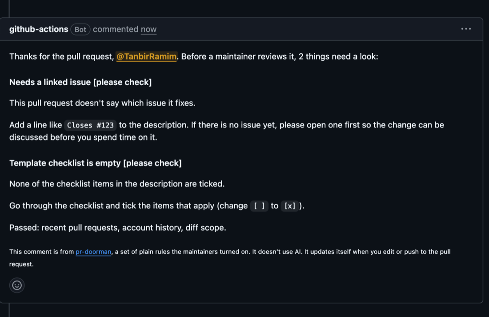

# pr-doorman

[](https://github.com/TanbirRamim/pr-doorman/actions/workflows/ci.yml) [](https://github.com/marketplace/actions/pr-doorman) [](https://github.com/TanbirRamim/pr-doorman/releases) [](LICENSE)

pr-doorman is a GitHub Action that looks at each new pull request and checks a few things maintainers otherwise check by hand: is there a linked issue, did someone else already claim that issue, is the author opening dozens of PRs a day, was the PR template deleted. It leaves one comment that explains what to fix, adds labels you can filter on, and updates both when the PR changes. Every check is a plain rule you can read in `src/checks/`. It never sends your code or PR text to an AI model.

I built it after a mix-up on one of my repos. Someone commented on an issue asking to take it, someone else opened a PR for the same issue a few hours later, and I merged the PR before I saw the comment. Nobody did anything wrong on purpose, but one person's time got wasted and I had to apologise. The claim check exists so that shows up on the PR itself, before anyone reviews or merges it.

## What the comment looks like

When something is flagged, the PR gets a single comment like this one from a [real run on the demo repo](https://github.com/TanbirRamim/pr-doorman-demo/pull/1). It's edited in place on every push, never reposted.



A claimed issue looks like this:

> Thanks for the pull request, @new-contributor. Before a maintainer reviews it, 2 things need a look:
>
> #### Issue was already claimed **[please check]**
>
> @early-bird asked to work on #17 on 2026-09-28 and a maintainer replied, before this pull request was opened.
>
> Please coordinate on #17 first. If @early-bird has moved on, say so there and a maintainer can sort it out. Claims expire after 7 days without activity.
>
> #### Template checklist is empty **[please check]**
>
> None of the checklist items in the description are ticked.
>
> Go through the checklist and tick the items that apply (change `[ ]` to `[x]`).
>
> Passed: linked issue, recent pull requests.
>
> <sub>This comment is from pr-doorman, a set of plain rules the maintainers turned on. It doesn't use AI. It updates itself when you edit or push to the pull request.</sub>

The PR also gets the labels `doorman: claimed-by-other` and `doorman: template-unchecked`. They're removed again once the checks pass.

## Setup

Add `.github/workflows/pr-doorman.yml`:

```yaml
name: pr-doorman

on:
  pull_request_target:
    types: [opened, edited, reopened, synchronize]

permissions:
  contents: read
  issues: write
  pull-requests: write

jobs:
  doorman:
    runs-on: ubuntu-latest
    steps:
      - uses: TanbirRamim/pr-doorman@v0
```

That's it. With no inputs it warns (comment and label) on missing linked issues, claimed issues, PR bursts and empty templates. It never closes anything and never fails the job unless you set a check to `fail`.

Owners, members, collaborators and bots are skipped, so your own PRs and Dependabot won't be touched.

### Why `pull_request_target` and is it safe?

PRs from forks get a read-only token under `pull_request`, which can't comment or label. `pull_request_target` runs in the context of your base branch with a token that can. That's only dangerous when a workflow checks out and runs the PR's code. pr-doorman never does that: it reads the PR through the API (body, author, file names, line counts) and nothing else. Don't add an `actions/checkout` of the PR head to the same job.

### Permissions

| Permission             | Why                                                                                     |
| ---------------------- | --------------------------------------------------------------------------------------- |
| `contents: read`       | Read the PR template from the base branch                                               |
| `issues: write`        | Read the linked issue and its comments, add and remove labels, write the sticky comment |
| `pull-requests: write` | Read the PR and its files, close it if `close-on-fail` is on                            |

The default `GITHUB_TOKEN` is enough. No other secrets.

## Checks

Each check takes a severity:

- `off`: don't run it, and don't make the API calls it needs
- `note`: only shows up in the job's step summary, for maintainers. Not in the comment, no label
- `warn`: shown in the comment, label added
- `fail`: same as warn, plus the job fails (`fail-job`) and the PR can be closed (`close-on-fail`)

| Check          | Default | Flags when                                                                                                                                                                                                                                |
| -------------- | ------- | ----------------------------------------------------------------------------------------------------------------------------------------------------------------------------------------------------------------------------------------- |
| `linked-issue` | `warn`  | The PR doesn't close an issue. Counts `Closes #12`, `fixes owner/repo#12`, issue URLs after a closing keyword, and issues linked from the sidebar (GitHub's `closingIssuesReferences`). Text in code blocks and HTML comments is ignored. |
| `claim`        | `warn`  | The linked issue is assigned to someone else, or someone else asked for it first ("I'd like to work on this", "can I take this", "assign me", `/assign`, ...) and a maintainer replied. See [how claims work](#how-claims-work).          |
| `pr-burst`     | `warn`  | The author opened more than `pr-burst-threshold` (10) PRs anywhere on GitHub in the last 24 hours.                                                                                                                                        |
| `template`     | `warn`  | Your repo has a PR template with checkboxes, and the PR either deleted the template or ticked none of them. Templates without checkboxes are ignored.                                                                                     |
| `account`      | `note`  | The account is younger than `account-min-age-days` (14) and has no merged PRs anywhere.                                                                                                                                                   |
| `diff-scope`   | `note`  | The PR changes files outside the paths you mapped to the linked issue's labels, or a first-time contributor's PR changes more than `large-diff-lines` (1000) lines.                                                                       |

### How claims work

pr-doorman reads the comments on the linked issue (the first one, if the PR closes several) and works out who has a claim on it:

1. Assignees always have a claim. Assignment doesn't expire.
2. A comment matching a claim phrase is a claim. By default it only counts if a maintainer (`OWNER`, `MEMBER` or `COLLABORATOR` association) replied afterwards, either mentioning the claimer or with no mentions at all before anyone else asked. A maintainer reply that only @mentions somebody else doesn't count.
3. Quoted lines (`> ...`) and code blocks are ignored, so quoting someone's claim doesn't make it yours.
4. A comment claim expires `claim-expiry-days` (7) after the claimer's last comment on the issue. Commenting "still working on this" keeps it alive.
5. Only comments from before the PR was opened count.

The check flags the PR when someone else holds an active claim that came before the author's own claim (if they made one). With `require-claim: true` it also flags PRs where the author never claimed the issue at all.

The built-in phrases are English only. If your community uses other languages or its own conventions, add regexes with `claim-phrases`.

## Inputs

All inputs are optional.

| Input                     | Default                       | Description                                                                                 |
| ------------------------- | ----------------------------- | ------------------------------------------------------------------------------------------- |
| `github-token`            | `${{ github.token }}`         | Token for API calls                                                                         |
| `linked-issue`            | `warn`                        | Severity for the linked-issue check                                                         |
| `claim`                   | `warn`                        | Severity for the claim check                                                                |
| `pr-burst`                | `warn`                        | Severity for the pr-burst check                                                             |
| `template`                | `warn`                        | Severity for the template check                                                             |
| `account`                 | `note`                        | Severity for the account check                                                              |
| `diff-scope`              | `note`                        | Severity for the diff-scope check                                                           |
| `claim-phrases`           |                               | Extra claim regexes, one per line, case-insensitive                                         |
| `claim-phrases-replace`   | `false`                       | Use only your `claim-phrases`, drop the built-in ones                                       |
| `claim-expiry-days`       | `7`                           | Days without activity before a comment claim expires                                        |
| `claim-requires-ack`      | `true`                        | Only count comment claims a maintainer replied to                                           |
| `require-claim`           | `false`                       | Flag PRs whose author never claimed the issue                                               |
| `maintainer-associations` | `OWNER, MEMBER, COLLABORATOR` | Who counts as a maintainer when acknowledging claims                                        |
| `pr-burst-threshold`      | `10`                          | Max PRs in 24 hours before flagging                                                         |
| `pr-burst-allowlist`      |                               | Logins exempt from pr-burst only                                                            |
| `template-path`           |                               | PR template path. Empty means `.github/pull_request_template.md` and the other usual places |
| `account-min-age-days`    | `14`                          | Account age below which the account check applies                                           |
| `diff-scope-paths`        |                               | Lines of `issue-label: glob, glob`                                                          |
| `large-diff-lines`        | `1000`                        | Line count above which a first contribution is flagged                                      |
| `allowlist`               |                               | Logins that skip every check                                                                |
| `skip-associations`       | `OWNER, MEMBER, COLLABORATOR` | Author associations that skip every check. `none` runs for everyone                         |
| `comment`                 | `true`                        | Post and update the sticky comment                                                          |
| `comment-on-pass`         | `false`                       | Also comment when nothing was flagged. An existing comment is always updated                |
| `add-labels`              | `true`                        | Add labels for flagged checks and remove them once fixed                                    |
| `labels`                  |                               | Rename labels, one `key: name` per line (see below)                                         |
| `close-on-fail`           | `false`                       | Close the PR when a `fail` check is flagged                                                 |
| `fail-job`                | `true`                        | Fail the job when a `fail` check is flagged                                                 |
| `dry-run`                 | `false`                       | Run the checks and log the comment, but don't comment, label or close                       |

Label keys and their default names: `needs-issue`, `claimed-by-other`, `not-claimed`, `pr-burst`, `template-missing`, `template-unchecked`, `new-account`, `out-of-scope`, `large-diff`, each prefixed with `doorman: `.

## Outputs

| Output           | Description                                     |
| ---------------- | ----------------------------------------------- |
| `result`         | `pass`, `note`, `warn`, `fail`, or `skipped`    |
| `failed-checks`  | Comma-separated ids of flagged checks at `fail` |
| `flagged-checks` | Comma-separated ids of every flagged check      |
| `labels`         | Labels this run wanted on the PR                |

## A stricter setup

For a project that wants every PR tied to a claimed issue and is fine closing the rest:

```yaml
- uses: TanbirRamim/pr-doorman@v0
  with:
    linked-issue: fail
    claim: fail
    require-claim: true
    claim-expiry-days: 14
    pr-burst-threshold: 5
    close-on-fail: true
    diff-scope: warn
    diff-scope-paths: |
      area: docs: docs/**, *.md
      area: cli: src/cli/**, test/cli/**
    labels: |
      needs-issue: needs issue
```

Try new settings with `dry-run: true` first. The step summary shows what would have happened.

## FAQ

**Does it use AI?**
No. No model, no scoring, no external service. Every result comes from a rule in `src/checks/` and the comment says which rule fired. The only network calls are to the GitHub API.

**Will it close PRs?**
Only if you set `close-on-fail: true` and set at least one check to `fail`. Out of the box it comments and labels.

**What about false positives?**
They'll happen. A claim phrase can show up in a sentence that isn't a claim, a maintainer's "thanks" can read as an acknowledgement, someone may have a good reason to delete the template. That's why the defaults are `warn`, the comment explains how to fix each item, and labels go away by themselves once things are fixed. If you see a misfire, please open an issue with the comment text.

**Will it spam the PR?**
No. There's one comment per PR, found by a hidden marker and edited in place. If nothing is flagged and there was no earlier comment, it doesn't comment at all.

**Does it work on private repos?**
Yes. The pr-burst and account checks search public activity, so for private-only accounts those numbers will be low.

**What about rate limits?**
A run makes roughly 8 to 15 API calls, two of them to the search API (30 requests a minute per token). Checks set to `off` skip their calls. If a call fails or hits a limit, that check is reported as skipped and the rest still run.

**Can I use it with `pull_request` instead?**
For PRs from branches in the same repo, yes. For forks the token is read-only, so use `dry-run: true` or you'll get permission errors.

## How it compares

[peakoss/anti-slop](https://github.com/peakoss/anti-slop) is the most complete tool in this space and worth a look. It has over 30 checks on PR content, commits, files and user signals, and it's built around closing low-quality PRs once enough checks fail. If your main problem is a flood of junk PRs, it's probably the better fit.

pr-doorman is smaller and aims at something slightly different: coordination. It knows about issue claims and assignments, it explains each problem to the contributor in plain words, and it defaults to labels and a comment rather than closing. You can run both.

GitHub's own interaction limits can restrict who opens PRs at all. That works, but it also shuts out the first-time contributors most projects want to keep.

## Roadmap

Rough order, nothing promised:

- Use the issue's assignment timeline so assignments can expire too
- Recognise "unassign me" or "no longer working on this" as giving up a claim
- A `claims` command that lists active claims across open issues
- Per-check exemptions by label (for example `doorman: skip`)
- Optional config file in the repo instead of workflow inputs

## Contributing

See [CONTRIBUTING.md](CONTRIBUTING.md). Please comment on an issue and wait for a reply before starting work on it.

## License

[MIT](LICENSE)
